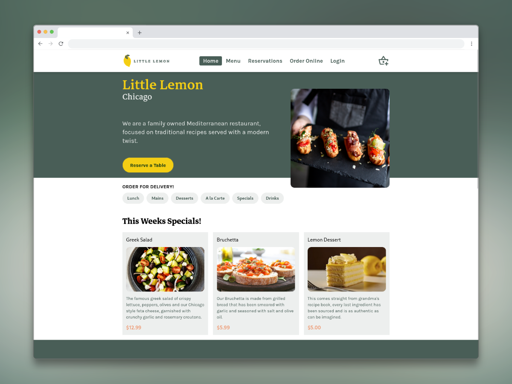
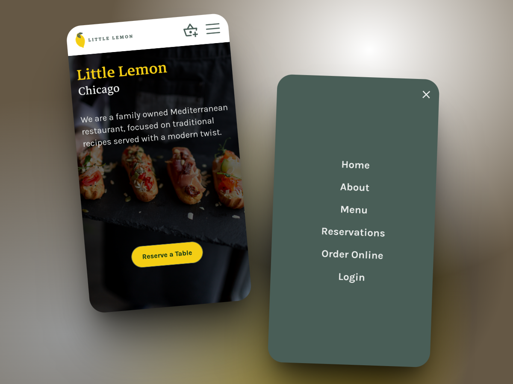

# The Little Lemon Restaurant - Final Project

This project is the culmination of the Meta Front-End Developer Professional Certificate course on Coursera. It represents the practical application of the knowledge and skills acquired during the program.

## Description

The Little Lemon Restaurant is a front-end web application designed to allow users to view the menu, reserve a table, and explore weekly specials. This project demonstrates the ability to build interactive and responsive user interfaces using modern web technologies.

## Features

*   Menu display with categories.
*   Online reservation system with real-time availability.
*   Responsive design for different devices.
*   Testimonials and weekly specials sections.
*   Interactive navigation with mobile-friendly menus.

## Technologies Used

*   **HTML5:** For the semantic structure of the content.
*   **CSS3:** For styling and visual design, including TailwindCSS for utility-first styling.
*   **JavaScript (ES6+):** For interactivity and client-side logic.
*   **React:** Main library for building the user interface.
    *   React Router for navigation.
    *   PropTypes for type-checking components.
*   **Vite:** For fast development and build tooling.
*   **TailwindCSS:** For responsive and modern styling.
<!-- *   **Jest/React Testing Library:** For testing (if applicable). -->

## Installation and Local Setup

1.  Clone the repository:
    ```bash
    git clone https://github.com/juliannGabrielDev/the-little-lemon-restaurant.git
    ```
2.  Navigate to the project directory:
    ```bash
    cd the-little-lemon-restaurant
    ```
3.  Install dependencies:
    ```bash
    npm install
    # or if using yarn:
    # yarn install
    ```
4.  Start the application in development mode:
    ```bash
    npm run dev
    ```
5.  Open your browser and visit `http://localhost:3000` (or the port your application uses).

## Screenshots

### Desktop



### Mobile



## Author

*   **Julián Alejandro Gabriel Isidro**
*   **Contact:** [GitHub](https://github.com/juliannGabrielDev)